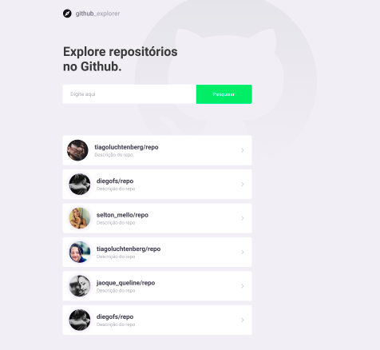
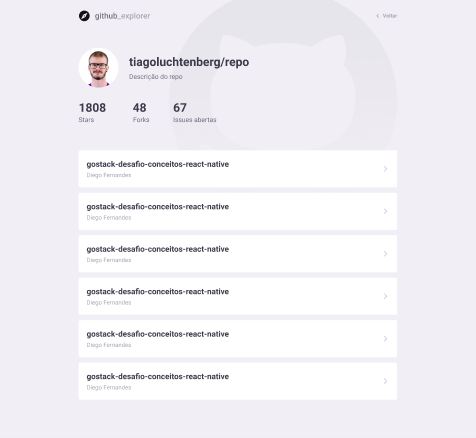

<h4 align="center">
:construction: :octocat: Github Explorer In progress.. :construction:
</h4>

<p align="center">
  <a href="#project">Project</a>&nbsp;&nbsp;&nbsp;|&nbsp;&nbsp;&nbsp;
  <a href="#technologies">Technologies</a>&nbsp;&nbsp;&nbsp;|&nbsp;&nbsp;&nbsp;
  <a href="#installation">Installation
</a>&nbsp;&nbsp;&nbsp;|&nbsp;&nbsp;&nbsp;
  <a href="#layout">Layout</a>&nbsp;&nbsp;&nbsp;|&nbsp;&nbsp;&nbsp;
  <a href="#how-to-contribute">How to contribute</a>&nbsp;&nbsp;&nbsp;|&nbsp;&nbsp;&nbsp;
  <a href="#license">License</a>
</p>

## Project

> Github Explorer is amazing github repositories - made with Reactjs and Typescript.

<h1 align="center">
    
</h1>

<h1 align="center">
    
</h1>

## Technologies

This project was developed with the following technologies:

- [Typescript](https://www.typescriptlang.org/)
- [Javascript](https://developer.mozilla.org/en-US/)
- [React](https://reactjs.org)

## Installation

``` js
  // First of all, you may clone this repo

  git clone

  // Install the dependencies

  yarn install

  // Start the application

  yarn start
```

## Layout

Para acessar o layout utilize a ferramenta [Figma](https://www.figma.com/file/HOCmxfrElzLpI75LdzFLia/Github-Explorer?node-id=0%3A1).

## How to contribute

- Make a fork;
- Create a branck with your feature: `git checkout -b my-feature`;
- Commit changes: `git commit -m 'feat: My new feature'`;
- Make a push to your branch: `git push origin my-feature`.

After merging your receipt request to done, you can delete a branch from yours.

## License

This project is under the MIT license. See the [LICENSE](LICENSE.md) for details.

Made with ♥ by Italo Cedro
